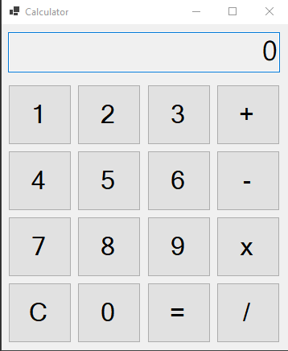
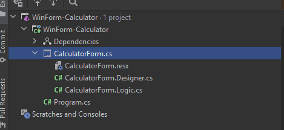

# `WinForms-Calculator`
A single view application using winforms that makes use of exceptions, concurrency and
events. in hopes to better understand winforms, because right now to me it seems like a terrible tool. 

## Quick learning notes
* File management is totally unclear in C# just by looking at the project with random files being added all over the place.
* The Design view is really slow and old fashioned to work with but it's a hell of a lot better than having to deal with the code directly.
* To write a simple timer is complex, Ideally I would just like something simple like
`Async.delay(5, TimeUnit.Seconds).run(() => TASK()).execute()`
* There isn't a nice way to obstract the view from model by just looking at the view.
* They have added a bunch of random options and files to make up for lack of file strucutre

